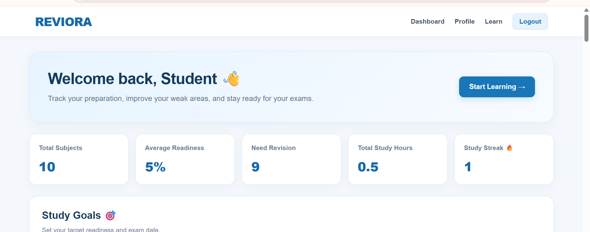

# REVIORA

### Know what you actually know.

REVIORA is a study and exam-preparation tracker I built as a BCA student.
It helps students keep track of their subjects, preparation level, study time, goals and revision needs — all in one place.

## What is REVIORA?
REVIORA is made for students who want a simple way to keep track of their exam preparation.
You can add your subjects, set how ready you feel for each one, track your study sessions and see which topics need more attention.
The main idea is simple: instead of asking yourself "What should I study now?", REVIORA helps you figure it out.

## Features
- Add and manage subjects
- Track readiness for each subject
- Set study goals and exam dates
- Track study sessions and total study hours
- Monitor study streaks
- See weekly study statistics
- Get revision reminders
- Identify subjects that need more attention
- Take quizzes and review answers
- Unlock study achievements
- Create and manage a student profile

## Technologies Used
- HTML
- CSS
- JavaScript
- LocalStorage
- Git
- GitHub

## How to Run
1. Clone or download this repository.
2. Open the project folder.
3. Open `home.html` in your browser.
4. Create an account and start using REVIORA.

No backend or database is required for the current version.

## What I Learned
Building REVIORA helped me understand how a real web project comes together.
While working on it, I learned how to:

- Build pages using HTML and CSS
- Add functionality using JavaScript
- Work with forms and user input
- Store data using LocalStorage
- Connect different pages together
- Create responsive layouts
- Use Git and GitHub
- Debug problems and fix issues

This project helped me become more comfortable with building practical projects instead of only learning theory.

## Future Plans
- Add a proper backend and database
- Add secure user authentication
- Improve the study priority system
- Add more practice quizzes
- Add better progress analytics
- Add exam reminders
- Make the dashboard more personalized

## About the Project
REVIORA is a personal project built as part of my journey of learning web development.
I built it from scratch while learning HTML, CSS and JavaScript, and worked on both the design and functionality myself.
This project represents one of my first steps toward building practical projects instead of only learning theory.

## Live Website
[REVIORA](https://swethakushwaha.github.io/REVIORA/)

## GitHub Repository
[REVIORA on GitHub](https://github.com/Swethakushwaha/REVIORA)

Built with HTML, CSS and JavaScript while learning web development.